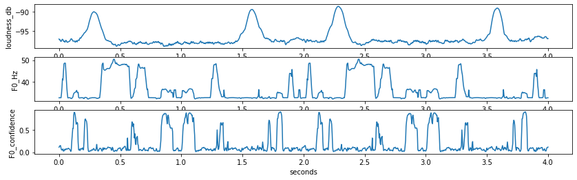

# eeg-ddsp
transfer correlate characteristics between alcoholic and sober EEG signals w/ [DDSP](https://magenta.tensorflow.org/ddsp). Done for BME 512

### Errata
- DDSP provides notebooks for [training an autoencoder](https://github.com/magenta/ddsp/blob/master/ddsp/colab/demos/train_autoencoder.ipynb) and [timbre transfer](https://colab.research.google.com/github/magenta/ddsp/blob/master/ddsp/colab/demos/timbre_transfer.ipynb) -- not included here. 
- Extremely janky preprocessing creates mostly-zero spectrogram
  - this neuters spectrogram loss since leaving signal unchanged is "mostly right"
    - could either fix preprocessing or attempt to "class-balance" the spectrogram loss
- Modules used were fairly limited and EEG-nonspecific
